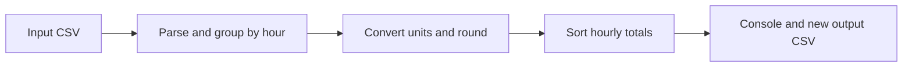

# CSV input and output reference

## Run a local file

```powershell
dotnet run --project "Evaluation task 2.csproj" -- "docs/examples/ingredients.csv" "hourly-result.csv"
```

The first argument is an existing input CSV. The second is a new output CSV path whose parent directory already exists. Relative paths are resolved from the current working directory. Quote paths containing spaces. `--help` displays the command syntax without reading or writing files.

The program will not overwrite an existing output or accept the same path for input and output. Choose a new output filename for each run. The README example output is ignored by Git; keep other real input and result files outside the repository.

## Pipeline



## Input CSV

The processor expects a comma-separated CSV file with this exact, case-sensitive header row:

```csv
TIMESTAMP,FLOUR,GROAT,MILK,EGG
2026-01-01T08:15:00,50,125,250,2
```

All five fields are required. `TIMESTAMP` must be parseable as a .NET `DateTime`; `FLOUR` and `EGG` are integers, while `GROAT` and `MILK` accept decimal values. Values are read using `InvariantCulture`, so use a period (`.`) as the decimal separator.

The conversion rules are:

| Input column | Interpreted unit | Output representation |
| --- | --- | --- |
| `FLOUR` | decagrams | kilograms; no explicit rounding in the source |
| `GROAT` | grams | kilograms, rounded to two decimal places |
| `MILK` | millilitres | litres, rounded to two decimal places |
| `EGG` | count | count |

Records that fall in the same hour are summed. Their timestamp is rounded down to the beginning of that hour, and the final rows are sorted by `TIMESTAMP`. Groat and milk are rounded after grouping, using the existing `Math.Round(value, 2)` midpoint-to-even behavior. This is not configurable and should not be treated as a financial or metrological rounding policy.

## Output CSV

The program writes a CSV file with the same five headers, now holding the hourly aggregate in the output units:

```csv
TIMESTAMP,FLOUR,GROAT,MILK,EGG
01/01/2026 08:00:00,1,1,1,3
01/01/2026 09:00:00,0.25,0.12,0.25,1
```

The [input fixture](examples/ingredients.csv) contains two records from 08:00-08:59 with a combined 100 decagrams of flour, 1,000 grams of groat, 1,000 millilitres of milk, and three eggs, plus one 09:05 record. The [expected output](examples/expected-hourly.csv) is checked by the smoke tests. CsvHelper serializes the timestamp with `InvariantCulture`; the value itself is always the start of the aggregated hour.

The console prints the same numeric values with invariant decimal separators and a `yyyy-MM-dd HH:mm:ss` timestamp, without adding an inferred timezone. It does not round the flour value to one decimal place for display.

## Failure behavior and exit codes

| Exit code | Meaning |
| --- | --- |
| `0` | Successful export, including a header-only input, or `--help`. |
| `1` | Input processing or output-file failure, including an existing output file. |
| `2` | Missing/invalid command arguments or identical input and output paths. |

Errors are written to standard error. An invalid or unreadable input does not create an output file. A write failure such as a full disk can leave a partial newly created output; do not consume it when the process returns a nonzero code. Existing files are never opened for overwriting.

## Scope and limitations

- The repository also contains an independent task in `Evaluation task 3/`, excluded from the primary project's compile items.
- The target framework remains .NET 7 and emits an end-of-support warning. No framework or dependency modernization is claimed here.
- Records are loaded into memory. Streaming large files, negative-value validation, overflow handling, and exhaustive numeric edge cases are not covered by this update.
- Timestamps are grouped by their parsed hour; there is no explicit timezone-normalization policy. Use timestamps from a consistent, known time basis rather than mixing timezones in one file.
- Use fictional records for demonstrations. Do not publish sensitive operational data in examples or issues.

## Verification

`pwsh -File tests/smoke.ps1` runs 11 checks after a Release build. It verifies both output rows, ordering and conversion, paths with spaces, header-only input, missing or malformed input, invalid arguments, input preservation, refusal to overwrite output, and an unavailable output directory.

Validated on Windows on 2026-09-25 with SDK 10.0.302 and runtime 7.0.20. This verifies the local code and examples, not GitHub Actions or a remote quality gate.

## Project layout

- `CsvDataReader.cs` reads the input data with CsvHelper.
- `DataService.cs` orchestrates loading, grouping, and conversion.
- `PancakeProcessor.cs` performs unit conversion and aggregation.
- `SumResults.cs` applies the final hourly sum and ordering.
- `DataAnalyzer.cs` prints the result to the console.
